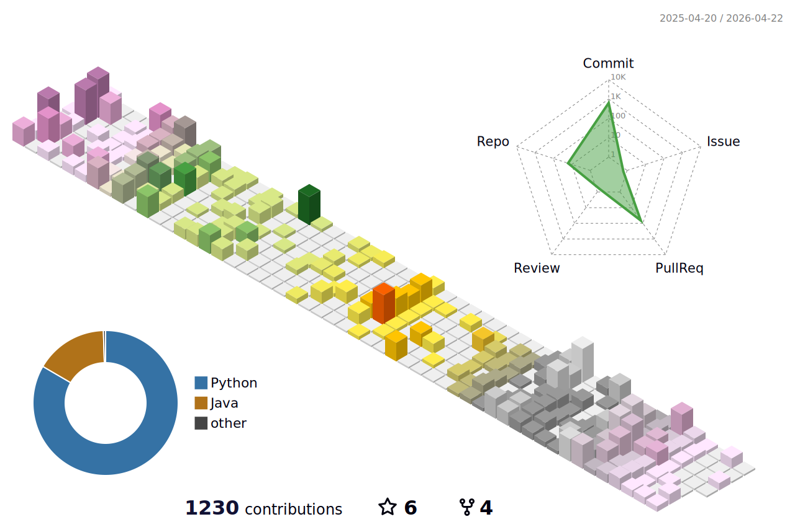

# README.md

> "What remains is not the code, but the structure behind it."

Hi, I'm a **Python Backend Engineer** who cares deeply about **maintainability**, **clarity**, and **developer experience**.  
I believe that a well-designed system architecture outlasts implementation details — and that's what I aim for every time I write code.

## 🔍 Characteristic

- 🧱 **Builds for the long term**
    - From small APIs to large-scale services, I think about how today's choices affect tomorrow's developers.
- 🛠️ **Loves clean abstractions**:
    - I enjoy crafting code that speaks for itself and designing systems that scale with clarity.
- ✍️ **Writes to learn**
    - Whether it’s documenting a tricky test setup or reflecting on tools like PyCrunch, I treat writing as part of the craft.
- 🔄 **Iterates constantly**
    - I experiment, test, reflect — and repeat. Tools are replaceable, but reasoning skills aren't.

 

## 🧩 Philosophy

I treat code not as a product, but as a process.  
In a world of ever-changing requirements, **structure is what survives**.

 

## Experience of Impact

### 🔐 Security & Reliability

Experience in enhancing service security and ensuring system reliability through vulnerability assessment and mitigation.

- **Identified and mitigated a SQL Injection vulnerability in a Serverless environment**  
  Reproduced a UNION-based SQLi attack using the `SLEEP()` function on unsafe string-formatted queries,  
  and proposed secure parameterized query methods to fix the issue.
- **Assessed and addressed a Server-Side Template Injection (SSTI) vulnerability**  
  Experimentally reproduced exploitation scenarios causing server lockups in PDF generation,  
  then designed and applied input validation limits to protect system stability.
- **Performed security audits for public sector servers**  
  Conducted web and server vulnerability assessments following KISA guidelines for institutions such as Korea Land and Geospatial Informatix
  Corporation and Korea Transportation Safety Authority.

### ⚙️ Performance Optimization & Infrastructure

Experience optimizing legacy systems and improving infrastructure to boost performance and scalability.

- **Improved data collection performance by approximately 30% by migrating from Selenium to API-based integration**  
  Analyzed Keycloak-based authentication systems and implemented API token exchange via password grant,  
  significantly reducing scraping latency.
- **Optimized currency rate scraping by 85–90%**  
  Replaced Selenium-driven scraping with direct HTTP requests using session cookies,  
  reducing runtime from 15–20 seconds down to 2–3 seconds.
- **Achieved zero data loss in a real-time GPU monitoring system**  
  Diagnosed ~20% data packet loss across 250 GPUs and introduced L7 load balancing to ensure reliable data ingestion.

### 🧱 System Design & Automation

Experience designing reusable system components and implementing automation to enhance quality and developer productivity.

- **Designed and developed a unified data collection module for five major advertising platforms**  
  Reduced platform-specific variations by creating reusable structures, contributing over 80% of the design and implementation.
- **Established automated testing infrastructure achieving 71% test coverage**  
  Introduced `pytest`-based automated tests for a previously manually verified system, improving stability and maintainability.
- **Developed Python-based crawlers for dynamic content aggregation**  
  Built and deployed YouTube and Instagram crawlers using Selenium with dynamic rendering handling, successfully applied in healthcare content
  projects.

 

## 📘 Writing

Check out my [blog](https://jakpentest.tistory.com) for dev logs, experiments, and learnings.

<!-- RECENTE ARTICLES START -->
- [FastAPI 아키텍처 어떻게 가져갈 것인가?](https://jakpentest.tistory.com/473) (2025-11-04)
- [JWK로 OAuth2 토큰 검증하기](https://jakpentest.tistory.com/472) (2025-11-03)
- [사이드 프로젝트를 정리하며](https://jakpentest.tistory.com/471) (2025-11-03)
- [실무로 통하는 웹 API](https://jakpentest.tistory.com/470) (2025-09-22)
- [[Review] 아키텍트 첫 걸음](https://jakpentest.tistory.com/469) (2025-08-26)
<!-- RECENTE ARTICLES END -->

 

## Contact

- Email : bluetoon@naver.com

 
