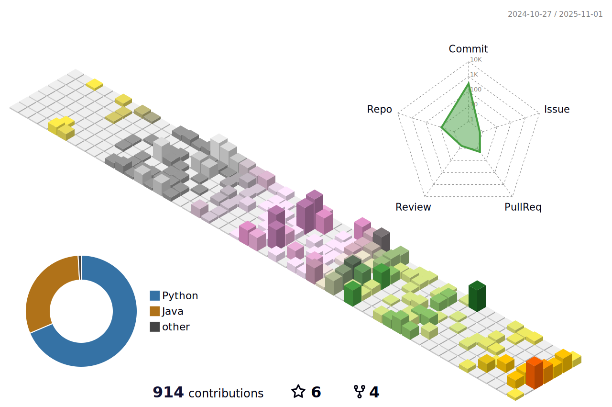

# README.md

> "What remains is not the code, but the structure behind it."

Hi, I'm a **Python Backend Engineer** who cares deeply about **maintainability**, **clarity**, and **developer experience**.  
I believe that a well-designed system architecture outlasts implementation details — and that's what I aim for every time I write code.

## 🔍 Characteristic

- 🧱 **Builds for the long term**
  - From small APIs to large-scale services, I think about how today's choices affect tomorrow's developers.
- 🛠️ **Loves clean abstractions**:
  -  I enjoy crafting code that speaks for itself and designing systems that scale with clarity.
- ✍️ **Writes to learn**
  -  Whether it’s documenting a tricky test setup or reflecting on tools like PyCrunch, I treat writing as part of the craft.
- 🔄 **Iterates constantly**
  -  I experiment, test, reflect — and repeat. Tools are replaceable, but reasoning skills aren't.

 

## 📘 Writing
Check out my [blog](https://jakpentest.tistory.com) for dev logs, experiments, and learnings.

 

## 🧩 Philosophy
I treat code not as a product, but as a process.  
In a world of ever-changing requirements, **structure is what survives**.

 

## Contact 
- Email : bluetoon@naver.com
  

